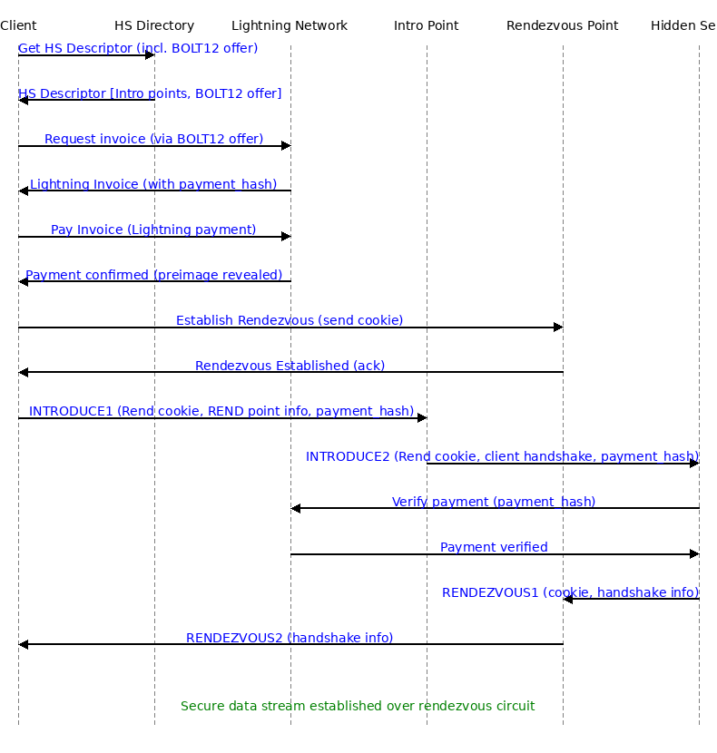

# Paid Hidden Service
### How to pay for a Rendezvous Circuit (Tor Hidden Service + Lightning Network)

**Overview:** The diagram below shows a UML-style sequence of interactions between a Tor **Client**, a **Hidden Service** (HS), an **Introduction Point** (Intro), a **Rendezvous Point** (RP), and the **Lightning Network**, implementing a *paid rendezvous circuit*. In this scenario, the hidden service requires the client to pay via Lightning before granting access. The sequence covers retrieving the HS descriptor (with a BOLT 12 Lightning offer), completing a Lightning payment, and then the usual Tor hidden service rendezvous handshake (INTRODUCE1/2 and RENDEZVOUS1/2 cells) with the payment proof integrated. All Tor protocol cell types (e.g. `INTRODUCE2`, `RENDEZVOUS1`, etc.) and payment-related messages are annotated in the diagram.  

  
*Figure: UML Sequence Diagram of a paid Tor hidden service rendezvous, involving Lightning Network payment. The client pays the hidden service (via a BOLT12 offer/Lightning invoice) before the hidden service will complete the Tor rendezvous handshake. Tor cells like `INTRODUCE1/2` and `RENDEZVOUS1/2` are shown in bold text, and the payment flow is included on the left side.* 

Below is a step-by-step breakdown of this sequence:

1. **Client Fetches Hidden Service Descriptor:** The client uses the onion address to query the Tor network’s distributed hash table (HS directory) for the hidden service’s descriptor ([Tor Project | How do Onion Services work?](https://community.torproject.org/onion-services/overview/#:~:text=it%2C%20so%20they%20connect%20to,descriptor%20of%20SecureDrop%27s%20Onion%20Service)). The descriptor is signed by the HS and contains a list of its introduction point addresses/keys ([Tor Project | How do Onion Services work?](https://community.torproject.org/onion-services/overview/#:~:text=And%20inside%20the%20descriptor%2C%20there,themselves%20to%20SecureDrop%27s%20Onion%20Service)). In this scenario, the HS descriptor also includes a Lightning **BOLT 12 offer** – a static offer code that the client can use to request a Lightning invoice from the hidden service.

2. **Lightning Invoice Request (BOLT 12 Offer):** Using the BOLT 12 offer from the descriptor, the client contacts the hidden service’s Lightning node via the Lightning Network to obtain a payment invoice. (BOLT 12 offers encode how to reach the node – either by its `node_id` or via a blinded path – in order to request an invoice ([lightning network - Can you know the final destination of a BOLT12 offer? - Bitcoin Stack Exchange](https://bitcoin.stackexchange.com/questions/116085/can-you-know-the-final-destination-of-a-bolt12-offer#:~:text=,that%20node%20using%20onion%20messages)).) The hidden service’s Lightning node responds by creating a Lightning invoice corresponding to the offer. This invoice includes the payment amount and a unique **`payment_hash`** (the hash of a secret preimage generated by the HS) which serves as an identifier for the payment ([How to prove that a lightning invoice was paid? | Blink FAQ](https://faq.blink.sv/blink-and-other-wallets/how-to-prove-that-a-lightning-invoice-was-paid#:~:text=,image)). The client receives this invoice and now proceeds to pay it.

3. **Client Pays Invoice (Lightning Payment):** The client’s Lightning wallet routes the payment through the Lightning Network to the hidden service’s node. Upon successful payment, the hidden service’s Lightning node receives the funds and, as per the Lightning protocol, releases the secret preimage associated with the invoice’s `payment_hash` ([How to prove that a lightning invoice was paid? | Blink FAQ](https://faq.blink.sv/blink-and-other-wallets/how-to-prove-that-a-lightning-invoice-was-paid#:~:text=,was%20included%20in%20the%20invoice)). The preimage travels back to the client as proof of payment. At this point, the payment is complete – the client knows the payment succeeded (having received the preimage), and the hidden service knows it has been paid. The client retains the `payment_hash` (and can derive the preimage) as a proof-of-payment for the Tor handshake.

4. **Client Establishes a Rendezvous Point:** In parallel with the payment (or afterward), the client prepares for the Tor connection. It randomly selects a Tor relay to serve as the **rendezvous point (RP)** for this session. The client builds a 3-hop Tor circuit to that relay and sends a `RELAY_COMMAND_ESTABLISH_RENDEZVOUS` message to designate it as the RP ([Tor Project | How do Onion Services work?](https://community.torproject.org/onion-services/overview/#:~:text=Before%20the%20introduction%20takes%20place%2C,part%20of%20the%20rendezvous%20procedure)). This message contains a randomly generated 20-byte **rendezvous cookie** that will serve as a shared secret for linking circuits ([The rendezvous protocol - Tor Specifications](https://spec.torproject.org/rend-spec/rendezvous-protocol.html#:~:text=The%20client%20sends%20the%20rendezvous,byte%20value)). The rendezvous point stores this cookie and replies with a `RENDEZVOUS_ESTABLISHED` acknowledgment (confirming it’s ready) ([torspec/rend-spec-v3.txt at main · torproject/torspec · GitHub](https://github.com/torproject/torspec/blob/main/rend-spec-v3.txt#:~:text=39%20)). At this stage, the RP is “parked” waiting for the hidden service to connect with the same cookie; it does not yet know which HS will connect.

5. **Client Builds Introduction Circuit:** Next, the client opens a Tor circuit to one of the hidden service’s **introduction points** listed in the descriptor. This is also a 3-hop anonymized circuit terminating at the chosen intro point. (The HS is already connected to this intro point via its own long-lived circuit.) Now the client has two circuits in place – one to the RP and one to the Intro point – and has paid the required Lightning invoice. The client is ready to introduce itself to the HS.

6. **Client Sends `INTRODUCE1` (with Rendezvous Info & Payment Hash):** Over the intro circuit, the client sends an **`INTRODUCE1`** cell to the introduction relay, requesting introduction to the HS ([torspec/rend-spec-v3.txt at main · torproject/torspec · GitHub](https://github.com/torproject/torspec/blob/main/rend-spec-v3.txt#:~:text=34%20)). This cell (encrypted to the HS’s service key) contains: the rendezvous cookie generated in step 4, the identity of the chosen rendezvous point, the client’s ephemeral key and other handshake data, **and the `payment_hash`** from the Lightning payment (as a token proving the client has paid). The introduction point then forwards this to the hidden service over the HS’s intro circuit as an **`INTRODUCE2`** cell ([torspec/rend-spec-v3.txt at main · torproject/torspec · GitHub](https://github.com/torproject/torspec/blob/main/rend-spec-v3.txt#:~:text=35%20)). In essence, the intro point “introduces” the client to the HS by delivering the client’s rendezvous details and payment proof. The hidden service receives the INTRODUCE2 message (containing the rendezvous cookie, RP address and payment hash) ([Tor Project | How do Onion Services work?](https://community.torproject.org/onion-services/overview/#:~:text=The%20introduction%20point%20passes%20your,whether%20you%27re%20trustworthy%20or%20not)).

7. **Hidden Service Verifies Payment:** Upon receiving the INTRODUCE2, the HS first verifies that this client is authorized – i.e. has paid the required invoice. The HS Tor process extracts the `payment_hash` from the introduce message and consults the hidden service’s Lightning node (or invoice database) to confirm that this hash corresponds to a completed payment. Since the client did pay, the HS finds the invoice marked as paid – the secret preimage for that `payment_hash` was revealed when the payment went through ([How to prove that a lightning invoice was paid? | Blink FAQ](https://faq.blink.sv/blink-and-other-wallets/how-to-prove-that-a-lightning-invoice-was-paid#:~:text=,was%20included%20in%20the%20invoice)). This check proves the client’s payment. (If the payment was not confirmed, the HS could refuse to proceed with the rendezvous, e.g. by ignoring the introduction or sending an INTRODUCE_ACK failure.) In our case, the payment is verified, so the HS proceeds.

8. **Hidden Service Builds Circuit to Rendezvous Point:** The hidden service now initiates the rendezvous from its side. The HS creates a new 3-hop Tor circuit out to the chosen rendezvous point (using the rendezvous address provided by the client in the INTRODUCE2 message). Once this circuit to the RP is established, the hidden service sends a **`RENDEZVOUS1`** cell to the rendezvous point over that circuit ([torspec/rend-spec-v3.txt at main · torproject/torspec · GitHub](https://github.com/torproject/torspec/blob/main/rend-spec-v3.txt#:~:text=36%20)). This message includes the same 20-byte rendezvous cookie (received via the intro point) and the HS’s part of the handshake (encrypted with the client’s public key from the introduction handshake). By sending RENDEZVOUS1, the HS is effectively saying “I am the hidden service that the client is trying to reach, here is the cookie to match and my handshake data.” The rendezvous point, upon seeing the cookie, recognizes it from step 4 and knows this HS corresponds to the waiting client connection.

9. **Exchanging `RENDEZVOUS1/2` and Completing Handshake:** When the HS’s RENDEZVOUS1 cell arrives at the rendezvous point, the RP links together the two circuits that share the same cookie (the client’s circuit from step 4 and the HS’s circuit from step 8). It then forwards the HS’s handshake data to the client by sending a **`RENDEZVOUS2`** cell down the client’s rendezvous circuit ([torspec/rend-spec-v3.txt at main · torproject/torspec · GitHub](https://github.com/torproject/torspec/blob/main/rend-spec-v3.txt#:~:text=37%20)). The RENDEZVOUS2 carries the hidden service’s encrypted handshake information to the client. The client’s Tor instance receives RENDEZVOUS2 and completes the cryptographic handshake (e.g. finishing the ntor key agreement using the HS’s public key in the handshake) ([Tor Project | How do Onion Services work?](https://community.torproject.org/onion-services/overview/#:~:text=The%20Onion%20Service%20connects%20to,been%20relayed%20through%20the%20service)). At this point, the rendezvous is established: the client and HS now have a shared session key, and the two Tor circuits are joined at the RP. (The rendezvous point has verified the cookie from both sides matched, and it will simply pass traffic between the client and HS from now on.)

10. **Rendezvous Circuit Established – Data Flows:** The client and hidden service now have an end-to-end encrypted channel through the rendezvous point. The Tor rendezvous handshake is complete, and a secure Tor circuit spans from the client to the HS (consisting of 3 hops from the client to RP, plus 3 hops from the HS to RP) ([Tor Project | How do Onion Services work?](https://community.torproject.org/onion-services/overview/#:~:text=Act%209%3A%20Where%20the%20Onion,Service%20rendezvous%20with%20the%20client)). The rendezvous point does not learn anything about the data or identities; it only knows the cookie used to connect the circuits. At this stage, the client can begin communicating with the hidden service (for example, sending an HTTP request if the HS is a web server). All data (the “secure data stream”) is tunneled through the rendezvous circuit – encrypted end-to-end between the client and HS and relayed by the RP. The hidden service has successfully received payment prior to communication, and the client and HS now communicate over the paid rendezvous circuit as they normally would over any Tor hidden service connection.

**References:** The above sequence integrates the Lightning Network payment into the Tor onion service connection protocol. For details on Tor’s rendezvous protocol, see Tor’s design documents ([Tor Project | How do Onion Services work?](https://community.torproject.org/onion-services/overview/#:~:text=The%20Onion%20Service%20connects%20to,been%20relayed%20through%20the%20service)) ([Tor Project | How do Onion Services work?](https://community.torproject.org/onion-services/overview/#:~:text=Act%209%3A%20Where%20the%20Onion,Service%20rendezvous%20with%20the%20client)) and specifications for cell types like `INTRODUCE2`, `RENDEZVOUS1`, and `RENDEZVOUS2` ([torspec/rend-spec-v3.txt at main · torproject/torspec · GitHub](https://github.com/torproject/torspec/blob/main/rend-spec-v3.txt#:~:text=35%20)) ([torspec/rend-spec-v3.txt at main · torproject/torspec · GitHub](https://github.com/torproject/torspec/blob/main/rend-spec-v3.txt#:~:text=36%20)). The Lightning offer/invoice process follows the BOLT 12 specification for requesting invoices ([lightning network - Can you know the final destination of a BOLT12 offer? - Bitcoin Stack Exchange](https://bitcoin.stackexchange.com/questions/116085/can-you-know-the-final-destination-of-a-bolt12-offer#:~:text=,that%20node%20using%20onion%20messages)), and Lightning’s payment proofs rely on revealing the preimage corresponding to a payment hash upon payment completion ([How to prove that a lightning invoice was paid? | Blink FAQ](https://faq.blink.sv/blink-and-other-wallets/how-to-prove-that-a-lightning-invoice-was-paid#:~:text=,was%20included%20in%20the%20invoice)). The hidden service uses the payment hash as a credential to authenticate the client’s introduction, only proceeding with the Tor handshake after verifying the invoice was paid in full. This ensures that the data exchange over the rendezvous circuit is authorized and paid for before it begins, combining the anonymity of Tor with the trust-minimized payments of Lightning. 

