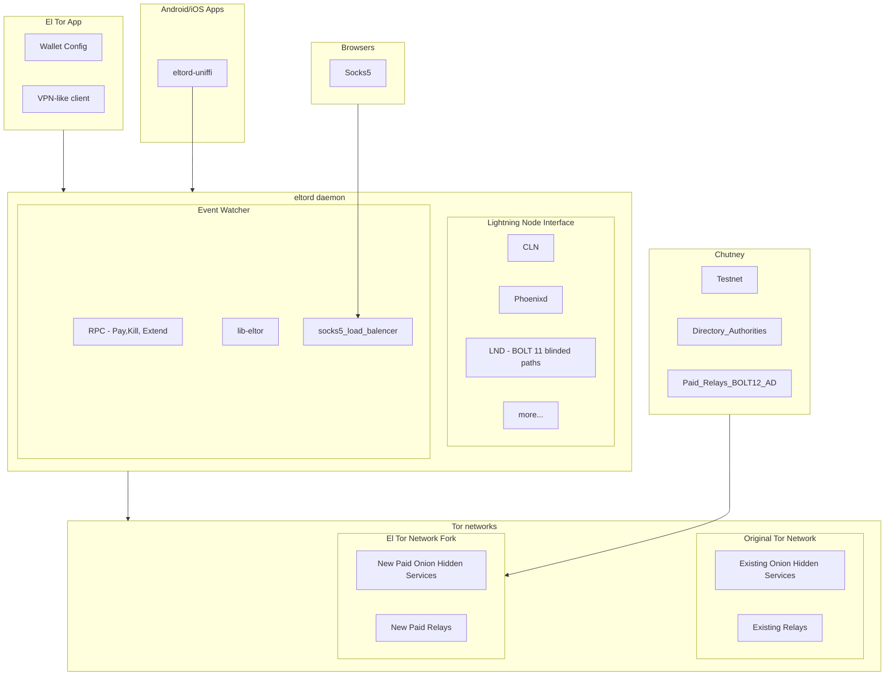

# El Tor Progress Report 1

## Summary

El Tor has made steady progress, advancing into a modular and extensible system. The major work completed this cycle was finalizing a spec for the "El Tor - Paid Circuit Protocol". Other work included spinning up a Testnet, writing a VPN-like client and diving into the BOLT 12 payment code.  While writing the code to connect to lightning nodes in the El Tor App, it became evident that supporting all major implementations—CLN, LNDK, and Phoenixd—required a unified tool. To address this need, the Lightning Node Interface (LNI) was born (WIP), creating a versatile library that simplifies integration with these implementations in Rust to support all major platforms.

Below is a outline of the major repos in the El Tor project. All repos have been moved from Bitbucket https://bitbucket.org/eltordev/eltor to Github https://github.com/orgs/el-tor/repositories

### Projects

- **eltor**: A fork of the Tor network that incorporates paid circuit handling and the EXTENDPAIDCIRCUIT RPC protocol. [GitHub Repository](https://github.com/el-tor/eltor)
- **eltord**: The primary daemon orchestrating El Tor's operations, connecting to wallets, monitoring payment events, and managing RPC calls. [GitHub Repository](https://github.com/el-tor/eltord)
- **eltor-app**: A VPN-like client application enabling connections to El Tor and remote wallets. It offers a user interface for relay management and hidden service creation. [GitHub Repository](https://github.com/el-tor/eltor-app)

### Libraries

- **libeltor**: A Rust-based fork of libtor, designed to embed a fully operational `eltord` daemon within projects, with fallback capabilities for standard Tor network integration. [GitHub Repository](https://github.com/el-tor/libeltor)
- **LNI**: The Lightning Node Interface library provides a unified interface for connecting to CLN, LND, Phoenixd, and other implementations. It includes bindings for Rust, Android, iOS, and JavaScript (Node.js, React Native). [GitHub Repository](https://github.com/lightning-node-interface/lni)

### Testnets

- **chutney**: A fork of the Tor testnet that integrates El Tor's paid relay infrastructure. [GitHub Repository](https://github.com/el-tor/chutney) 
- launched a public directory authroity here [Directory Authority Consensus file](http://93.127.216.111:7055/tor/status-vote/current/consensus)

# El Tor Architecture

Here is the architecture for El Tor.

## Sections

### 1. El Tor Spec and Paid Circuit Protocol

#### Summary

The foundational specifications for El Tor, encompassing the core protocol and the paid circuit protocol, have been finalized (for this iteration). These define the mechanisms for establishing, maintaining, and compensating circuits within the El Tor framework.

#### Details

- **El Tor Spec:** The specification integrates El Tor with existing Tor infrastructures and incorporates payment mechanisms. Key elements include:
  - **Circuit Establishment:** Step-by-step guidance on circuit initialization and maintenance.
  - **Payment Integration:** Implementation of Lightning Network-based payments.
  - **Security Enhancements:** Protections against adversarial actors. ([View the full Spec here](https://github.com/el-tor/eltord/blob/master/spec/00_spec.md))
- **Paid Circuit Protocol:** This protocol outlines:
  - **Payment Verification:** Ensuring accurate processing and validation.
  - **Preimage Verification:** Secure authentication of payments.
  - **Circuit Teardown:** Secure mechanisms for circuit closure. ([View Protocol](https://github.com/el-tor/eltord/blob/master/spec/01_paid_circuits.md))

#### Outcome

The specification has been well-received from peers in community, and its clarity provides a robust foundation for further development.

---

### 2. El Tor VPN-like Client UI

#### Summary

The VPN-like client UI for El Tor has reached a functional design state, providing an intuitive user experience for interacting with the network and managing payment-based connections.

#### Details

- **UI Features:**
  - **Dashboard:** Real-time monitoring of active circuits and connectivity status.
  - **Settings:** Customization options for payment methods and relay configurations.
  - **Diagnostics:** Tools to troubleshoot common connectivity issues.
- **Core Functionalities:**
  - Integration of Lightning Network payments.
  - User-friendly circuit selection and management tools.

#### Outcome

Feedback from early testers confirms that the application meets functional and usability expectations.

---

### 3. LNI - Lightning Node Interface

#### Summary

The Lightning Node Interface (LNI) is central to El Tor’s payment integration, offering seamless connectivity to various Lightning Network implementations.

#### Details

- **Enhancements:**
  - **Invoice Handling:** Efficient generation and validation of Lightning Network invoices.
  - **Performance Optimization:** High throughput with minimal latency.
  - **Error Recovery:** Advanced mechanisms for handling failed transactions. ([View ReadMe](https://github.com/lightning-node-interface/lni/blob/master/readme.md))
- **Key Features:**
  - Comprehensive support for invoice generation.
  - Simplified API interfaces for developers.

#### Outcome

The library’s stability and performance are aligned with project objectives and ready for broader deployment.

---

### 4. Architecture with Libtor Fork

#### Summary

Significant architectural improvements have been made to the Libtor fork, ensuring its seamless integration with El Tor’s functionalities.

#### Details

- **Enhancements:**
  - **SOCKS5 Proxy:** Augmented to support paid circuits.
  - **Path Optimization:** Advanced routing algorithms tailored for payment-based use cases.
  - **Compatibility:** Maintains interoperability with existing Tor libraries.

#### Outcome

The architecture is robust and prepared for comprehensive testing and deployment.

---

## Next Steps

1. Finalize and release the El Tor VPN-like client for beta testing.
2. Conduct extensive testing of the paid circuit protocol in live environments.
3. Optimize Libtor for enhanced stability and scalability.
4. Expand community engagement to foster collaboration and feedback.

---

## Conclusion

The El Tor project continues to progress across multiple fronts, achieving significant milestones in protocol specification, application development, and architectural refinement. The focus remains on iterative improvement and community collaboration to deliver a robust, scalable, and impactful solution.

