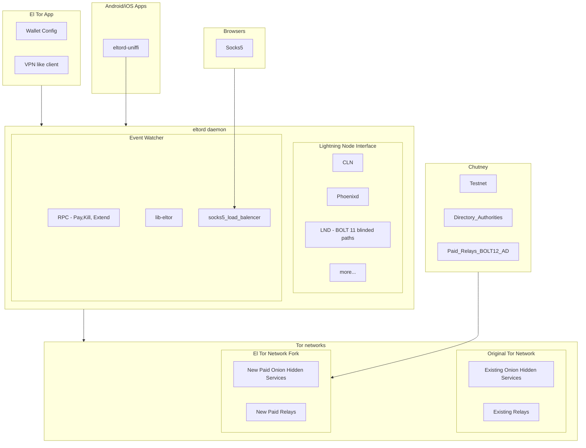

# El Tor Architecture

```mermaid
flowchart TB
    subgraph eltord[eltord daemon]
        subgraph LNI[Lightning Node Interface]
            CLN
            Phoenixd
            LND[LND - BOLT 11 blinded paths]
            more...
        end
        subgraph watcher[Event Watcher]
            
            rpc_calls[RPC - Pay,Kill, Extend]
            lib-eltor
            socks5_load_balencer
        end
    end
    
    subgraph ElTorApp[El Tor App]
        Wallet[Wallet Config]
        vpn[VPN like client]
    end

    subgraph MobileApp[Android/iOS Apps]
        eltord-uniffi
    end

    subgraph tornet[Tor networks]
        subgraph tor[Original Tor Network]
            EOS[Existing Onion Hidden Services]
            EPR[Existing Relays]
        end
        subgraph eltor[El Tor Network Fork]
            NOS[New Paid Onion Hidden Services]
            NPR[New Paid Relays]
            
        end
    end

    subgraph Browsers
        Socks5
    end

    subgraph Chutney
        Testnet
        Directory_Authorities
        Paid_Relays_BOLT12_AD
    end

    ElTorApp ---> eltord
    eltord-uniffi ---> eltord
    eltord ---> tornet
    Browsers ---> socks5_load_balencer
    Chutney ---> eltor

```